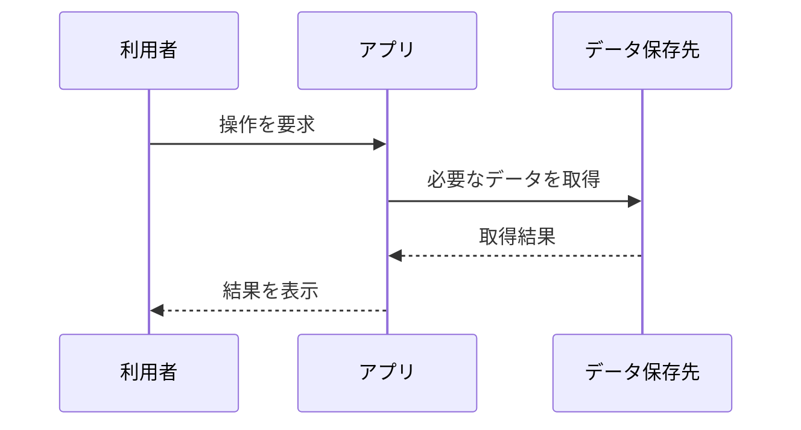

# 文書の構成例

既存の保存先・命名・文書形式を優先する。以下は作成候補であり、すべてのファイルを作る指示ではない。依頼が一機能なら一つの文書でまとめてもよい。

## 概要の例

```markdown
# プロジェクト概要

## 目的と主な機能
実コードとREADMEで確認できた対象利用者・目的・機能。

## 技術構成と入口
言語、主要ライブラリ、起動点、根拠ファイルへのリンク。

## ディレクトリの要点
主要なディレクトリと責務。依存・生成物は省く。

## 開発の始め方
設定項目、依存の準備、実行・検証手順。未実行の手順は未実行と明記。

## 未確認事項
まだ読んでいない範囲や、コードだけでは分からない前提。
```

## 設計の例

```markdown
# アーキテクチャ

## システム境界
利用者、対象システム、外部サービス、送受信する情報。

## 実行単位とデータ保存先
アプリ、サービス、データベースなど。実際の配置が未確認なら論理構造と明示。

## コンポーネントと依存関係
主要な責務と呼出方向。根拠のコードへのリンク。

## 設計判断
既存仕様・ADRの参照先、判断の理由とトレードオフ。
コードから推測する場合は推測と書く。
```

C4構文が描画できない環境では、下記のような通常のMermaidで粒度を表せる。登場要素は説明用の見本なので、実コードで確認したものへ置き換える。


## 処理フローの例

````markdown
# 主要な処理フロー

## 対象操作
何を入力すると何が返るか。入口と主要な呼出先へのリンク。



## 状態と例外
正常系、空状態、失敗、再試行など、確認できた分岐。

## 検証根拠
関連テストと、実行済み／未実行の区別。
````

図は説明用の見本であり、そのまま成果物へ貼り付けない。呼出・状態・データモデルによってsequenceDiagram、stateDiagram、erDiagram、classDiagram、flowchartを使い分ける。

## モジュール詳細の例

```markdown
# 対象モジュール

## 責務と主要ファイル
担当すること、担当しないこと、根拠ファイルへのリンク。

## 公開インターフェース
入力、出力、エラー、制約。

## 実装と依存
主要な処理、内部・外部依存、関連する設計文書へのリンク。

## テスト
対象と実行方法。実行した場合だけ結果を記載。

## 未確認・改善候補
事実と提案を分離する。文書化の中で実装は変更しない。
```

## 保存後の報告例

- 作成・更新: 実在する文書へのリンク
- 調査範囲: 読み取った入口・機能・主要モジュール
- 確認: ファイル・相対リンクの再読取、コードとの照合
- 図: 構文確認の結果、描画確認の結果を別々に記載
- 未確認: 未実行の手順、調査対象外のモジュール、出典不明の設計意図

「全体の何%を解析」「何%正確」などは、実際に計測した定義と証拠がない限り書かない。
